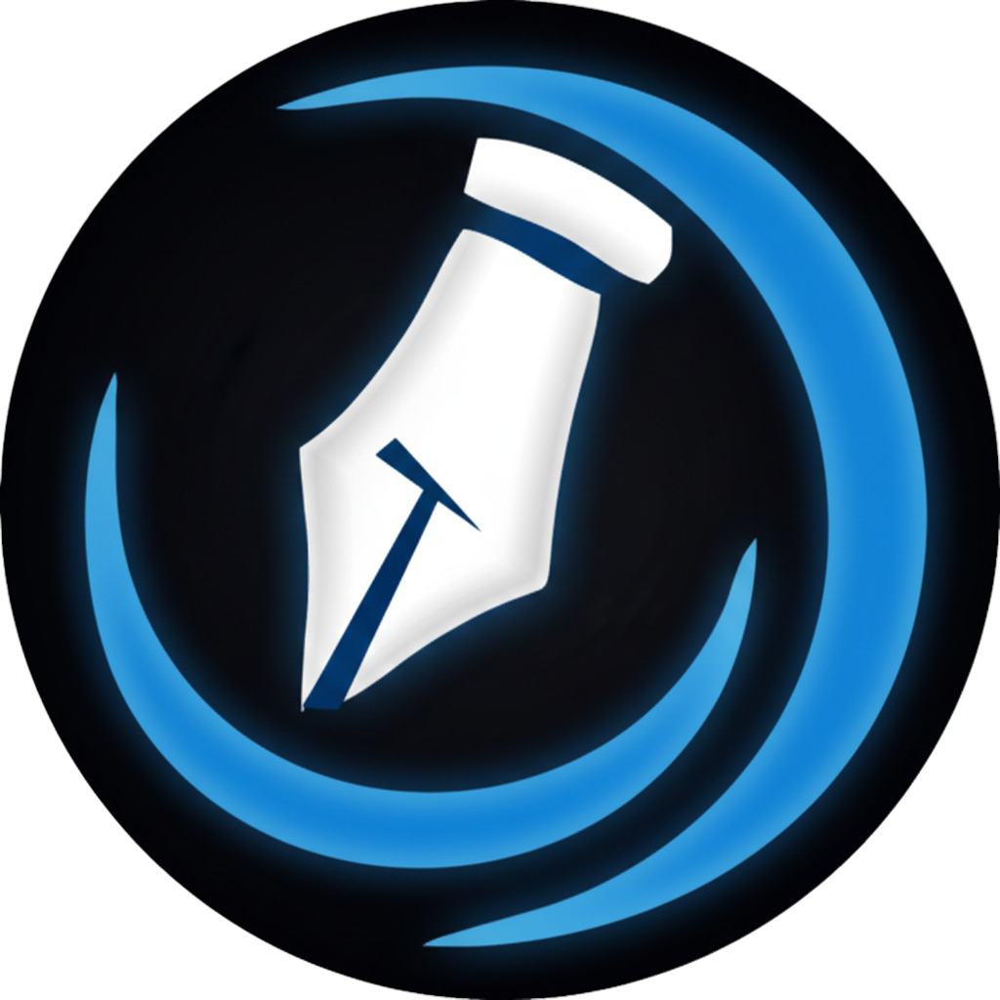

# Evoke EduGlobal LMS (Software)

**Evoke EduGlobal LMS** is a powerful desktop application for student management, fee tracking, and academic administration. Packaged as a standalone Windows executable (.exe), it offers seamless offline/online synchronization with MongoDB Atlas.

---

## 📥 **Download & Install the Software**

To get the software running on your computer, follow these simple steps:

### 1. Download the Installer
Go to the **[Releases Section](https://github.com/Vikas-Maurya-hack/Evoke_LMS_EXE/releases)** of this repository and download the latest version:
*   **File Name**: `SoftLearn_LMS_Installer_v1.0.0.zip` (Contains the setup file)

### 2. Install
1.  **Unzip** the downloaded file.
2.  Run (`Double-click`) the **`SoftLearn LMS Setup 1.0.0.exe`** file.
3.  If prompted by Windows SmartScreen ("Windows protected your PC"), click **More Info** -> **Run Anyway**.
4.  Follow the setup wizard to complete installation.

### 3. Launch
*   After installation, you will see a **"SoftLearn LMS"** shortcut on your Desktop.
*   Double-click to open the application.
*   **Note:** Internet connection is required for the first login to sync with the cloud database.

---

## 🚀 Key Features of the Software

*   **Student Management**: 
    *   Add new students with photos and details.
    *   View comprehensive student profiles and activity logs.
*   **Fee & Payment System**:
    *   Record fees (Cash, UPI, Bank Transfer).
    *   Automatic receipt generation.
    *   View pending dues and payment history.
*   **Course Management**: Create structured courses with fees and durations.
*   **Dashboard & Analytics**:
    *   Visual representation of total revenue.
    *   Active student counts.
    *   Recent transaction feed.
*   **Secure & Robust**:
    *   Role-based access control (Admin/Super Admin).
    *   Optimized for various network environments (works on restricted corporate/school networks).

---

## 🔧 Troubleshooting

If you encounter issues:

*   **"Cloud not connect to server"**: Wait a moment for the background services to start. Ensure you are connected to the internet.
*   **Installation blocked by Antivirus**: Since this is custom enterprise software, you may need to whitelist the installer or "Allow" it in your firewall settings.
*   **Error Logs**: If the application crashes, check your Desktop for a file named `SoftLearn_error.log` and share it with support.

---

## 👨‍💻 For Developers (Source Code)

This repository also contains the source code for the application.

### Tech Stack
*   **Frontend**: React, TypeScript, Vite, Tailwind CSS
*   **Backend**: Node.js, Express, MongoDB
*   **Packaging**: Electron, Electron Builder

### Building from Source
1.  Clone this repository.
2.  Set up environment variables in `.env`.
3.  Run `npm install` and `npm run electron:dev`.

---
**Developed for Evoke EduGlobal** | v1.0.0